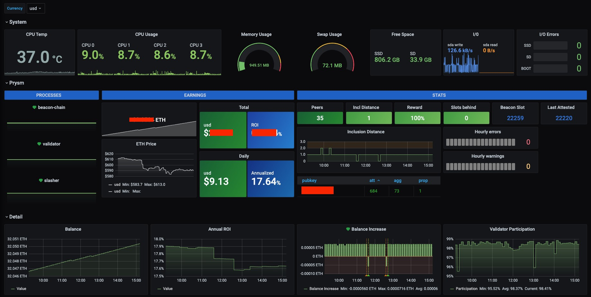

# grafana-eth-staking
Grafana dashboard for Ethereum 2.0 Staking with Prysm



## Installation

Install Prometheus and Prometheus Node Exporter

```bash
sudo apt-get install -y prometheus prometheus-node-exporter
```

Build Cryptowatch Exporter (golang required)
```bash
cd $USER
git clone https://github.com/nbarrientos/cryptowat_exporter.git && cd cryptowat_exporter
make
```

Replace contents of `/etc/prometheus/prometheus.yml` with
```
global:
  scrape_interval:     10s 

scrape_configs:
  - job_name: 'node_exporter'
    static_configs:
      - targets: ['localhost:9100']
  - job_name: 'validator'
    static_configs:
      - targets: ['localhost:8081']
  - job_name: 'beacon node'
    static_configs:
      - targets: ['localhost:8080']
  - job_name: 'slasher'
    static_configs:
      - targets: ['localhost:8082']
  - job_name: 'cryptowatch'
    scrape_interval: 300s
    static_configs:
      - targets: ['localhost:9745']

```


Install Grafana

```bash
wget -q -O - https://packages.grafana.com/gpg.key | sudo apt-key add -
echo "deb https://packages.grafana.com/oss/deb stable main" > grafana.list
sudo mv grafana.list /etc/apt/sources.list.d/grafana.list
sudo apt-get update && sudo apt-get install -y grafana
```

Create service for cryptowat_exporter and move to `/etc/systemd/system/cryptowatch.service`, e.g.:

```
[Unit]
Description     = cryptowatch service
After           = network-online.target

[Service]
User            = ubuntu
ExecStart       = /home/$USER/cryptowat_exporter/cryptowat_exporter --cryptowat.pairs="ethusd,ethchf" --cryptowat.exchanges="kraken" --cryptowat.cacheseconds="300"
Restart         = on-failure

[Install]
WantedBy    	= multi-user.target
```

Enable services

```bash
sudo systemctl daemon-reload
sudo systemctl enable cryptowatch.service
sudo systemctl enable grafana-server.service
sudo systemctl enable prometheus.service
sudo systemctl enable prometheus-node-exporter.service
```

